# marathon-like deepseek harness skin

给 DeepSeek Harness 做的一套酸性工业皮肤。

从 Marathon 的大色块、硬边界和工业排版开始：字标切开，按钮收方，工作区放上三位数字。正文留出空间，切换时让颜色沿着界面的方向走。

`v2.4.0` · `Windows` · `Harness 0.2.0-rc.2`

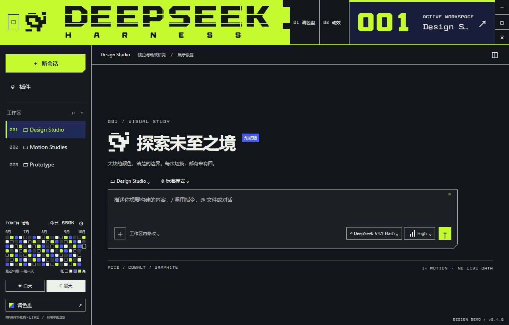

图片和 **19 组 GIF** 录自独立展示页，都是 **1×**。动效、字体、配色与 token 活动分档算法来自正式插件；页面外壳、工作区名称、模型目录、内容和用量计数使用展示样例。展示页不连接真实会话。

## 先看颜色和字

这组夜间配色只有四个角色：酸性绿抓住操作和当前状态，蓝色标出交互，石墨黑留给阅读，灰白色撑起正文。四块遮罩也直接取这四种颜色。

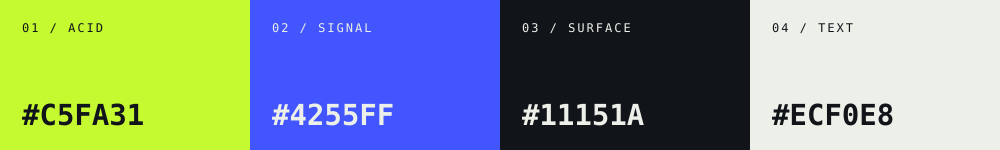

字标用矩形切割和断口。GRID 放在开屏、HARNESS 字样和大号数字上，SIGNAL 放在编号与辅助信息里；中文正文保留原来的字体和字号。

**开屏。** 色板从下方铺上来，横线走完，整块向上退去。

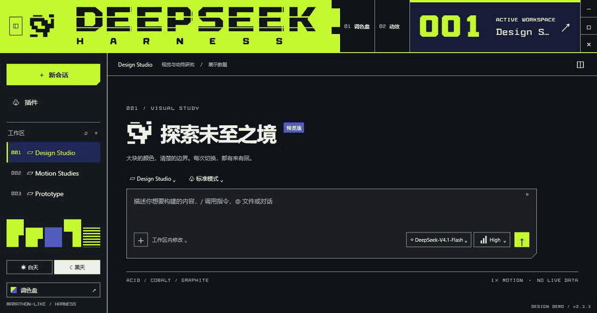

**换一组颜色。** 调色盘改完，标题、侧栏、正文和遮罩一起更新。Max 的残影也跟着当前配色走。


**白天与黑天。** 阅读区跟着模式换，字标和边界仍然清楚。两套颜色分别保存。

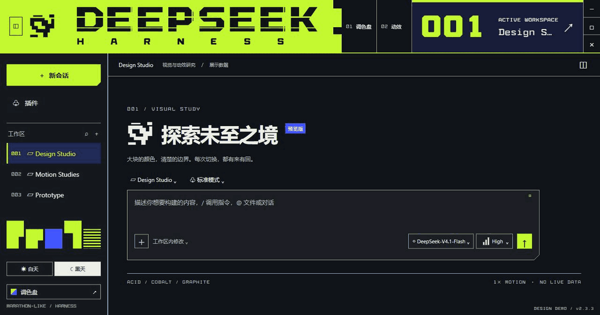

## 用量也有自己的颜色

侧栏底部换成 **18 列 × 7 行** 的 token 活动图。一格一天，显示最近 18 周；今日用细边框标出，空白日期是灰色。四种调色盘颜色依次落在阅读背景、正文色、交互色和酸性色上。

三个默认界限是 **100 万 / 1000 万 / 5000 万**。每日总量超过一个界限，今日方块就换到下一种颜色；换调色盘或明暗模式，活动图也一起更新。

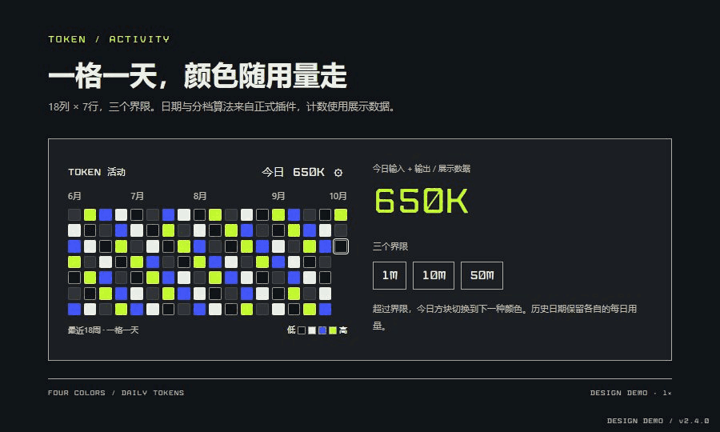

正式插件统计整个应用所有工作区、会话与子代理的**输入 + 输出 token**，按北京时间划分日期。输入包含缓存，推理已经包含在输出里；分叉继承记录排除，避免重复计数。悬停或键盘聚焦可以查看当天的输入、输出与总量。

点击图旁齿轮，可保存三个递增的界限。恰好等于界限时保留当前档，超过后才换色；侧栏收起后留下今日用量小按钮和设置入口。

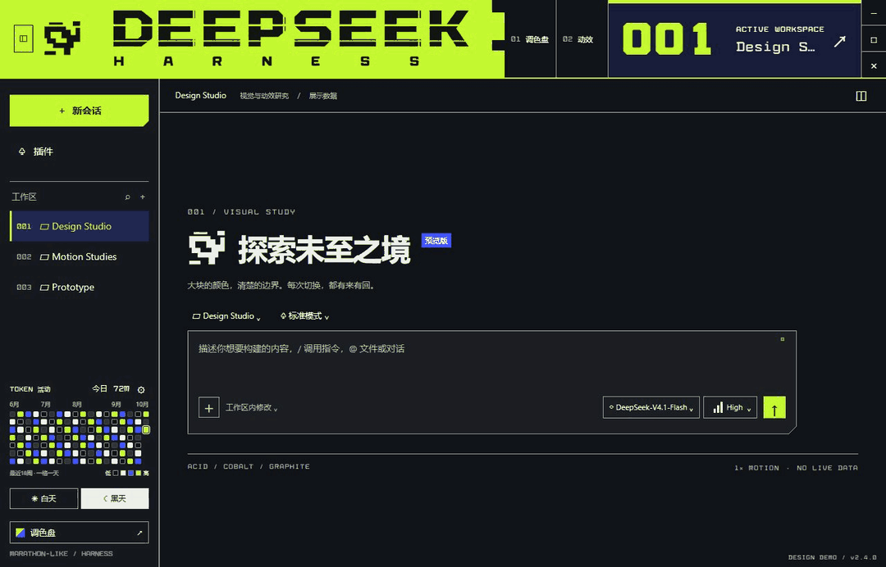

## 切换要有来有回

遮罩的动作很简单：先盖住旧画面，停一小拍，再沿原路退回。侧栏走水平方向，页面、菜单和弹窗走竖直方向。

**左侧栏。** 从左向右盖过去，再向左揭开。展开和收起用同一套动作。

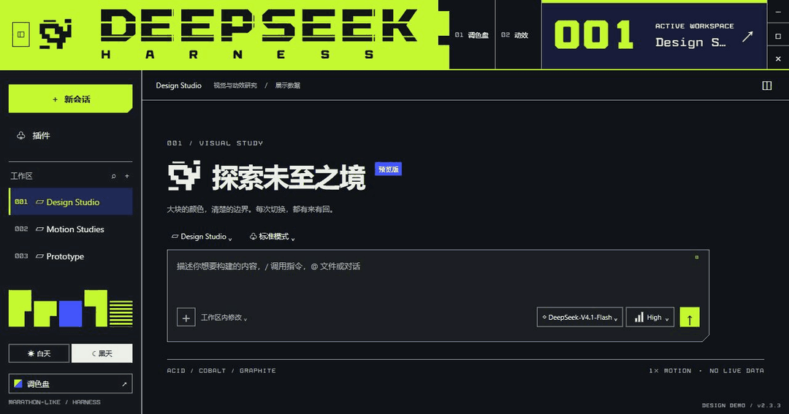

**右侧栏。** 方向正好镜像；文件预览沿着右侧栏的方向切换。

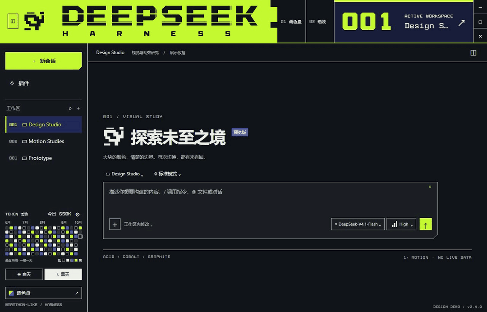

**整页切换。** 旧页面留到色板完全覆盖，再露出新页面。

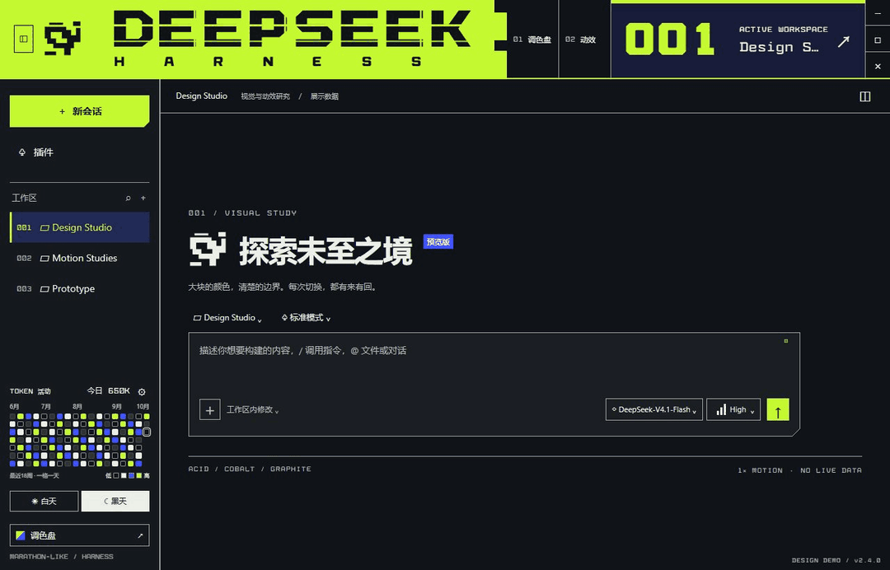

**文件标签。** 切到另一份文件，内容区走一次相同的往返。

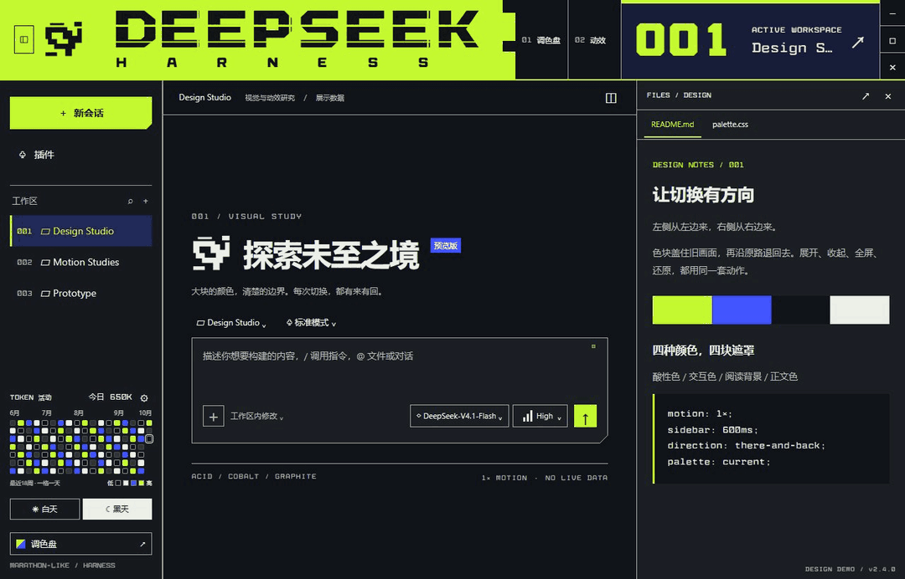

## 编号和小动作

工作区编号跟真实列表的次序走。大号数字切换时做一次扫描校准，名称直接更新；数字动起来，旁边的文字保持安静。

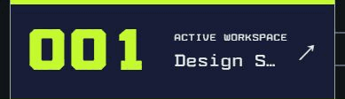

侧栏收起后，`001`、`002`、`003` 留在窄栏里。可以直接选工作区，当前项高亮，悬停能看到名称。

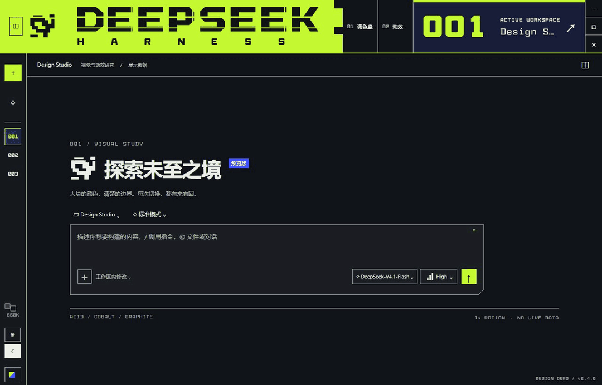

按钮的反馈落在四个角上：悬停时 **3px 厚角** 收拢，按下时从中心填满，再外扩一圈轮廓。

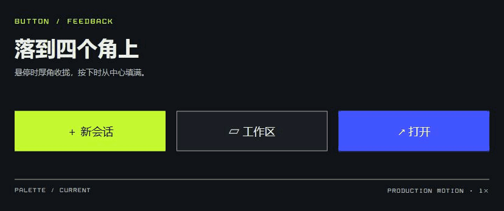

输入框得到焦点，边线接上，厚角落位，右上角的小灯亮起。正文和光标留在原处。

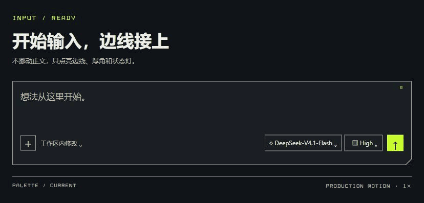

状态变化用四个小方块接力亮一下。同一状态不会反复播放。

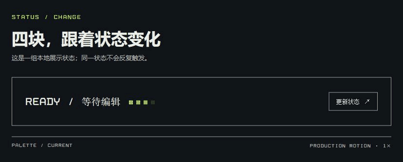

## 菜单也用这套动作

模型菜单和调色盘弹窗，打开时盖住再揭开，关闭时原路收回。转场做完就撤掉临时图层。

**模型与思考强度。** 模型、等级和保存动作仍由 Harness 提供。

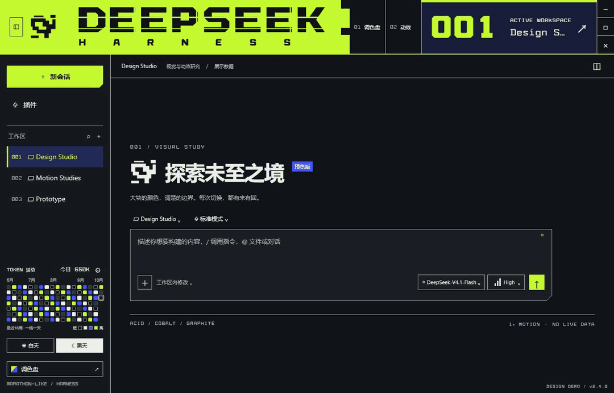

**调色盘。** 色块只在弹窗范围里走，后面的页面保持原位。


## High → Max

平常的轨道保持稳定。从 High 往 Max 推，震动和残影才逐渐变强；到 Max 后持续，拖回 High 就收住。

三轮选型后留下了这三种。这里分开看，插件里随机出现；一次蓄力保持同一种，回到 High 或更低后再重新抽选。

**01 / 同频震颤**

滑块和轨道一起发紧，短距离的双层残影跟着震动。

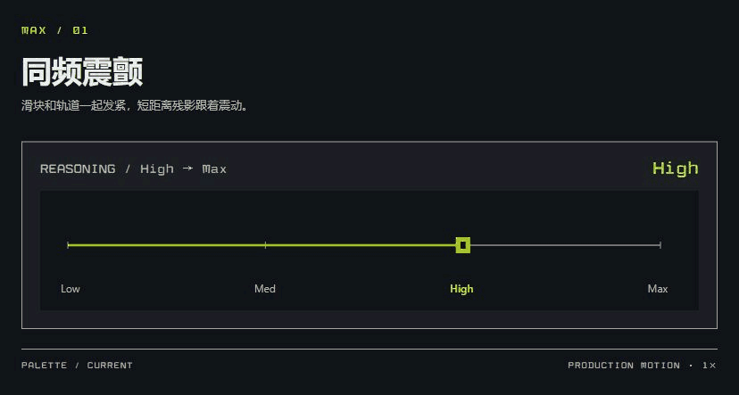

**02 / 残像追赶**

残影拉长，速度线逐渐展开，能看见滑块后面拖出的几层延迟。

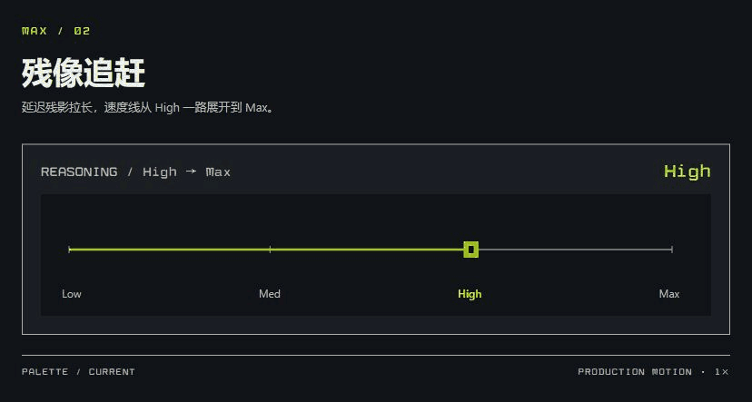

**03 / 错帧暴走**

轨道分片错位，重影把边缘撕开。幅度随位置增加，配色随调色盘变化。

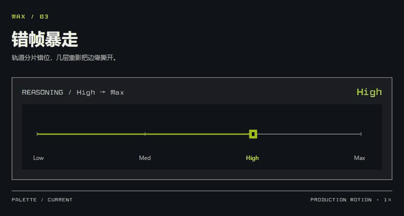

动效有「完整 / 克制 / 停止」三档，也跟随系统的“减少动态效果”。停止时仍保留静态 Max 标识。

## 安装

1. 从 [Releases](https://github.com/yasneg616/marathon-like-deepseek-harness-skin/releases/tag/v2.4.0) 下载 `dsh-industrial-acid-skin-2.4.0.tgz`。
2. 在 Harness 的「插件 → 添加插件」中导入并启用。
3. 在侧栏调色盘，或「设置 → 通用设置 → 皮肤外观」里调整颜色和动效。

当前验证范围是 **Windows / Harness 0.2.0-rc.2**。竖排窗口按钮需要单独的 Windows 桌面适配器；安装、构建和回退步骤放在 [安装与开发](docs/INSTALL.md) 里。

想自己拨一拨滑块、试一下切换，可以运行仓库里的展示页：

```sh
node tools/serve-showcase.cjs
```

打开 [本地动效展示页](http://127.0.0.1:19411/?controls=1)。它使用展示数据，不连接 Harness。字体与 SVG 内置，皮肤资源可以离线加载。

设计方向参考 [Marathon](https://marathonthegame.com/zh-chs)。这是非官方皮肤，与 DeepSeek、Bungie 或 Marathon 没有隶属关系；不包含 Marathon 官网代码或游戏素材。

[MIT License](LICENSE) · [GRID / SIGNAL 字体来源](assets/fonts/SOURCE.md)
